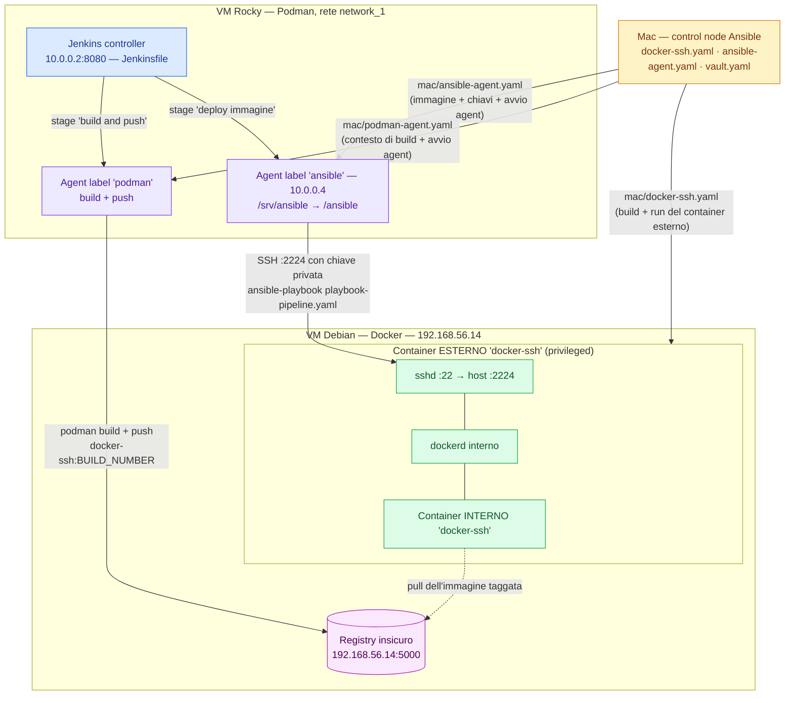

# Jenkins & Ansible — build, tag progressivo, push su registry e deploy via Ansible

Questo repository contiene tutto il materiale di **Configuration Management + CI/CD** in cui:

1. un container (`docker-ssh`) viene preparato con Ansible su una VM Debian;
2. una pipeline Jenkins builda un'immagine, la tagga con un **numero di build progressivo** e la pusha su un **registry locale insicuro**;
3. la stessa pipeline, cambiando agent a metà esecuzione, usa **Ansible** per fare il deploy di quell'immagine **dentro** il container bersaglio (Docker-in-Docker).

Questo file è la **vista d'insieme**: chi sono gli attori, come sono collegati e qual è il flusso completo.
I dettagli di *cosa accade dentro ogni singola macchina* stanno nei README dedicati:

| Cartella | Macchina | README |
|---|---|---|
| `mac/` | Mac (workstation, control node Ansible) | [`mac/README.md`](mac/README.md) |
| `rocky/` | VM Rocky Linux (Podman, Jenkins controller + agent) | [`rocky/README.md`](rocky/README.md) |
| `debian/` | VM Debian (Docker, registry, container bersaglio) | [`debian/README.md`](debian/README.md) |

---

## Gli attori

Ci sono **tre macchine**, ognuna con un ruolo netto e non sovrapposto.

| Macchina | Motore container | Ruolo | Indirizzi |
|---|---|---|---|
| **Mac** | — | **Control node Ansible**: da qui partono i playbook di preparazione. Non ospita nulla: è la "mano" dell'operatore. | — |
| **VM Rocky** | **Podman** | **Cervello CI**: ospita il controller Jenkins e i due agent (`podman` e `ansible`) che eseguono gli stage della pipeline. | `192.168.56.12`; sulla rete Podman `network_1`: controller `10.0.0.2:8080`, agent di build `10.0.0.3`, agent di deploy `10.0.0.4` |
| **VM Debian** | **Docker** | **Bersaglio + registry**: ospita il registry locale insicuro e il container `docker-ssh`, che a sua volta contiene un proprio Docker daemon. | `192.168.56.14`, registry `:5000`, SSH del container `:2224` |

---

## Architettura



---

## Le due fasi del progetto

### Fase A — Preparazione degli ambienti (dal Mac, con Ansible)

Questa fase è il prerequisito della pipeline e **si lancia interamente dal Mac**: i tre playbook in `mac/` costruiscono da soli l'ambiente delle due VM, partendo dai file sorgente che stanno sul Mac in `/etc/ansible/`.

`mac/docker-ssh.yaml` sulla **VM Debian** copia il contesto di build (`Dockerfile` + `entrypoint.sh`), builda l'immagine `docker-ssh`, crea la directory `/home/andrea/overlay` per il volume e avvia il container privilegiato con SSH pubblicato su `2224`.

`mac/ansible-agent.yaml` sulla **VM Rocky** copia il `Dockerfile-ansible-agent`, builda l'immagine dell'agent, copia inventario e playbook di deploy in `/srv/ansible`, **genera lì la coppia di chiavi SSH** dell'agent e avvia il container agent `ansible` agganciandolo al controller con il segreto letto dal vault.

`mac/podman-agent.yaml`, sempre sulla **VM Rocky**, scrive con un template la configurazione che autorizza Podman a usare il registry insicuro, builda l'immagine dell'agent di build da `Dockerfile-podman-agent`, copia in `/home/jenkins/agent` il contesto che la pipeline userà (di nuovo `Dockerfile` ed `entrypoint.sh` di `docker-ssh`) e avvia l'agent, anch'esso con il segreto letto dal vault.

Resta fuori dall'automazione **una cosa sola**: installare la chiave pubblica dell'agent nel container `docker-ssh`. La coppia viene generata su Rocky in `/srv/ansible/ansible-agent-key.pub`, e quella pubblica va messa in `/home/andrea/.ssh/authorized_keys` dentro il container bersaglio. Senza, l'agent non entra.

### Fase B — Esecuzione (automatica, a ogni build di Jenkins)

Da qui in poi tutto è guidato dal `Jenkinsfile`, e si ripete identico a ogni build cambiando solo il numero di tag.

---

## La pipeline: `Jenkinsfile`

```groovy
pipeline {
    agent { label 'podman' }

    environment {
        IMAGE = "192.168.56.14:5000/docker-ssh:${env.BUILD_NUMBER}"
    }

    stages {
        stage('build and push') {
            steps {
                sh "podman build -t ${env.IMAGE} /home/jenkins/agent"
                sh "podman push ${env.IMAGE}"
            }
        }

        stage('deploy immagine') {
            agent { label 'ansible' }
            steps {
                sh "ansible-playbook -i /ansible/inventario -e image=${env.IMAGE} /ansible/playbook-pipeline.yaml"
            }
        }
    }
}
```

- **`agent { label 'podman' }` in cima** — è l'agent di default: ogni stage che non ne dichiara uno proprio gira lì.
- **`IMAGE = ...:${env.BUILD_NUMBER}`** — è il **tag progressivo**. `BUILD_NUMBER` è valorizzato automaticamente da Jenkins e cresce di uno a ogni esecuzione (1, 2, 3…), quindi ogni build produce un'immagine distinta e tracciabile invece di sovrascrivere sempre `:latest`.
- **`agent { label 'ansible' }` dentro il secondo stage** — la pipeline **cambia nodo a metà esecuzione**. Il primo stage ha bisogno di Podman, il secondo di Ansible, della chiave SSH e dei playbook: sono due immagini diverse, ognuna minimale per il proprio scopo. Il valore di `IMAGE` viene passato al secondo stage attraverso `-e image=...`, che sovrascrive il default scritto nel playbook.

---

## Flusso end-to-end di una build

Prerequisito: Fase A completata (container esterno `docker-ssh` attivo su Debian, agent Jenkins registrati, chiave pubblica installata sul bersaglio).

1. Un utente (o un trigger) avvia la pipeline su Jenkins.
2. Jenkins assegna lo stage **`build and push`** all'agent con label `podman`, sulla VM Rocky.
3. L'agent esegue `podman build` sul Dockerfile che si trova in `/home/jenkins/agent` — la workdir dell'agent, montata dall'host e riempita da `mac/podman-agent.yaml` — e tagga l'immagine `192.168.56.14:5000/docker-ssh:<BUILD_NUMBER>`.
4. L'agent esegue `podman push` verso il **registry insicuro** sulla VM Debian (`192.168.56.14:5000`). Funziona solo perché Podman è stato configurato per accettare quel registry in HTTP.
5. Jenkins assegna lo stage **`deploy immagine`** all'agent con label `ansible` (sempre su Rocky, ma altro container).
6. L'agent Ansible legge `/ansible/inventario` (montato da `/srv/ansible` della VM Rocky), che punta a `192.168.56.14:2224`.
7. Ansible si connette via **SSH come utente `andrea`** con la chiave privata montata. Grazie al port mapping `2224→22` della VM Debian, la connessione non finisce sulla VM ma **dentro il container `docker-ssh` esterno**.
8. Dentro quel container gira anche un **dockerd** (avviato in background dall'entrypoint) configurato per fidarsi del registry insicuro, e sono installati `python3` + `python3-docker`: è così che il modulo `community.docker.docker_container` può parlargli.
9. Il task Ansible, con `recreate: true`, ferma e ricrea il container **interno** `docker-ssh` a partire dall'immagine appena pushata: il dockerd interno la scarica dal registry e la avvia, ripubblicando la porta 22 sulla 2224 (questa volta all'interno del container esterno).

Risultato: ogni build produce una nuova immagine numerata e la rimpiazza automaticamente nell'ambiente bersaglio.

---

## Concetti trasversali

**Tag progressivo.** Usare `:latest` renderebbe impossibile capire quale immagine sta girando e impedirebbe un rollback. `BUILD_NUMBER` lega 1-a-1 immagine ed esecuzione della pipeline.

**Registry insicuro.** Il registry locale è in HTTP, senza TLS né autenticazione. Sia Docker sia Podman per default **rifiutano** di parlare in chiaro con un registry (errore tipico: *"server gave HTTP response to HTTPS client"*). Per questo va whitelistato due volte: in `/etc/docker/daemon.json` (`insecure-registries`) per il dockerd **dentro** il container bersaglio, che fa il pull; e in `/etc/containers/registries.conf.d/` (`insecure = true`) per Podman **sulla VM Rocky**, che fa il push — quest'ultimo scritto da `mac/podman-agent.yaml` con un template.

**Docker-in-Docker.** Il container bersaglio deve a sua volta eseguire container. Servono tre accorgimenti: `privileged: true` (per namespace, cgroup, device e mount), un bind mount di `/var/lib/docker` su una directory reale dell'host (per evitare *overlay su overlay*, che il kernel spesso non supporta), e un entrypoint che avvii dockerd in background tenendo `sshd` come PID 1.

**Segreti con Ansible Vault.** Il secret di registrazione dell'agent Jenkins è una credenziale: vive cifrato in `mac/vault.yaml` e viene richiamato dal playbook via `vars_files`, così il repository non contiene segreti in chiaro.

---

## Mappa dei file

```
jenkins&ansible/
├── README.md                    ← questo file 
├── Jenkinsfile                  ← la pipeline: build+push su podman, deploy su ansible
│
├── mac/                         ← eseguito DAL Mac (control node Ansible)
│   ├── README.md
│   ├── docker-ssh.yaml          → prepara la VM Debian
│   ├── ansible-agent.yaml       → prepara l'agent "ansible" sulla VM Rocky
│   ├── podman-agent.yaml        → prepara l'agent "podman" sulla VM Rocky
│   └── vault.yaml               → segreti dei due agent, cifrati con Ansible Vault
│
├── rocky/                       ← contenuti della VM Rocky (Podman + Jenkins)
│   ├── README.md
│   ├── Dockerfile-ansible-agent → immagine dell'agent "ansible" (deploy)
│   ├── Dockerfile-podman-agent  → immagine dell'agent "podman" (build)
│   ├── registries.conf.j2       → template del registry insicuro per Podman
│   ├── inventario               → inventario usato dalla pipeline
│   └── playbook-pipeline.yaml   → playbook di deploy lanciato dalla pipeline
│
└── debian/                      ← contenuti della VM Debian (Docker + registry)
    ├── README.md
    ├── Dockerfile               → immagine del container bersaglio docker-ssh
    └── entrypoint.sh            → avvia dockerd in background e sshd in foreground
```

---

## Ordine di esecuzione

### Presupposti d'ambiente (una tantum, non creati dai playbook)

| Dove | Cosa |
|---|---|
| Debian | Docker installato; **registry insicuro** in ascolto sulla 5000 |
| Rocky | Podman installato; **controller Jenkins** attivo su `10.0.0.2:8080`; rete Podman **`network_1`** esistente |
| Jenkins | i due nodi creati nella UI, con le label `podman` e `ansible`; i loro segreti salvati in `mac/vault.yaml` |
| Mac | Ansible con le collection `community.docker`, `containers.podman`, `community.crypto`; i sorgenti in `/etc/ansible/debian/` e `/etc/ansible/rocky/`; un inventario con i gruppi `rocky` e `debian` |