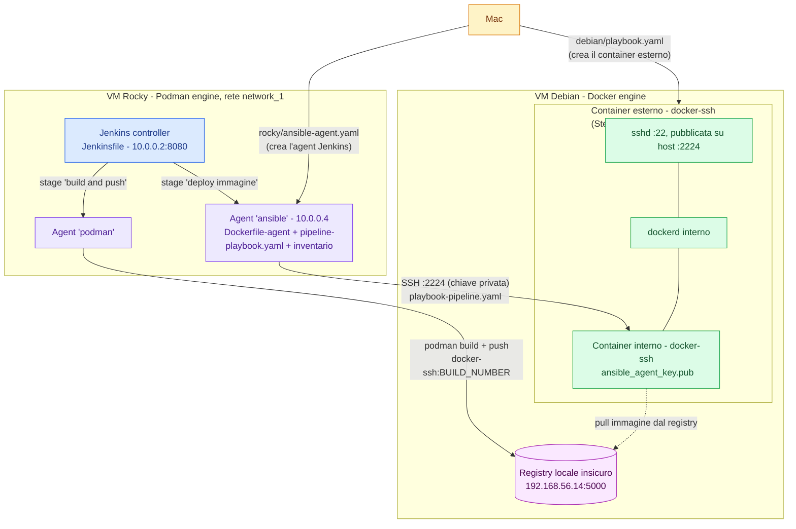

# Jenkins & Ansible: build, tag progressivo, push e deploy via Ansible

## Panoramica dell'architettura

Il progetto usa **due VM**:

- **Debian**, con **Docker** installato, che ospita il container bersaglio del deploy (con SSH + Docker interno).
- **Rocky**, con **Podman** installato, che ospita sia il **controller Jenkins** sia i due agent (`podman` e `ansible`) usati dalla pipeline.



---

## Il container bersaglio: "docker-ssh" sulla VM Debian

### `debian/Dockerfile`

```dockerfile
RUN apt-get update && \
    apt-get install -y sudo openssh-server docker.io python3 python3-docker && \
    rm -rf /var/lib/apt/lists/*
```

**Perché questi pacchetti, uno per uno**:
- `sudo` — serve al punto "utente abilitato a fare sudo"
- `openssh-server` — il demone SSH, requisito "sempre in ascolto sulla porta 22 / servizio ssh attivo".
- `docker.io` — il container deve avere il servizio Docker attivo al suo interno. 
- `python3` e `python3-docker` — sono la ragione tecnica per cui questo container può essere gestito da Ansible tramite i moduli `community.docker.*`. I moduli Ansible per Docker non parlano SSH+CLI: parlano con il socket Docker tramite la libreria Python `docker`.

```dockerfile
RUN mkdir -p /etc/docker && cat > /etc/docker/daemon.json <<'EOF'
{
  "insecure-registries": ["192.168.56.14:5000"]
}
EOF
```

Il registry locale non ha TLS né autenticazione. Per default Docker **rifiuta** di comunicare in chiaro (HTTP) con un registry, restituendo un errore tipo *"server gave HTTP response to HTTPS client"*. Whitelistare l'indirizzo come `insecure-registries` dice esplicitamente al demone Docker interno "fidati, va bene HTTP per questo host": è quello che permette poi al dockerd *dentro* questo container di fare il `pull` dell'immagine pushata da Jenkins.

```dockerfile
COPY entrypoint.sh /usr/local/bin/entrypoint.sh
RUN chmod +x /usr/local/bin/entrypoint.sh
CMD ["/usr/local/bin/entrypoint.sh"]
```

Il comando di avvio non è direttamente `sshd`, ma uno script wrapper

### `debian/entrypoint.sh`

```bash
#!/bin/bash
set -e

dockerd &> /var/log/dockerd.log &
sleep 10
exec /usr/sbin/sshd -D -e
```

Un container Docker ha un solo processo "principale" (PID 1) e il ciclo di vita del container è legato a quel processo. Qui però ci servono **due servizi attivi contemporaneamente** dentro lo stesso container: il demone Docker e sshd . La soluzione adottata è:

1. `dockerd &> /var/log/dockerd.log &` — avvia il demone Docker in background, redirigendo i log su file (altrimenti si perderebbero, dato che lo stdout del container sarà quello di sshd dopo l'`exec`).
2. `sleep 10` — dockerd impiega qualche secondo a creare il socket e diventare operativo; questa pausa evita che qualcosa tenti di parlare con un demone non ancora pronto.
3. `exec /usr/sbin/sshd -D -e` — `exec` sostituisce il processo corrente (lo script bash) con sshd, che diventa il PID 1 effettivo del container: da questo momento il container resta vivo finché sshd resta vivo. `-D` tiene sshd in foreground `-e` manda i log di sshd su stderr.

### La chiave SSH per l'utente andrea

La coppia usata invece specificamente per il canale Ansible → container (agent "ansible" che si autentica su `docker-ssh`) è quella dedicata generata per questo step: `rocky/ansible_agent_key.pub` (parte pubblica) e `ansible-agent-key` (parte privata, montata nell'agent).

### `debian/playbook.yaml`(MAC)

```yaml
- name: Crea il container docker-ssh esterno
  hosts: debian
  become: true

  tasks:
    - name: Build immagine docker
      community.docker.docker_image_build:
        name: docker-ssh
        tag: latest
        path: /home/andrea/build
        dockerfile: Dockerfile

    - name: Avvia il container
      community.docker.docker_container:
        name: docker-ssh
        image: docker-ssh
        pull: never
        state: started
        privileged: true
        published_ports:
          - "2224:22"
        volumes:
          - /home/andrea/overlay:/var/lib/docker
```

Punto per punto, il perché delle opzioni:

- **`docker_image_build` con `path: /home/andrea/build`** — builda l'immagine partendo dal Dockerfile visto sopra, copiato in quella directory sulla VM Debian.
- **`pull: never`** — l'immagine `docker-ssh` esiste solo localmente (appena buildata), non su nessun registry. Senza `pull: never`, il modulo Ansible potrebbe tentare di scaricare un'immagine con lo stesso nome da Docker Hub. `pull: never` forza l'uso della cache locale.
- **`privileged: true`** — serve **specificamente per il Docker-in-Docker**: il dockerd che deve girare dentro questo container ha bisogno di creare namespace di rete, cgroup, device e mount di tipo overlay — operazioni che richiedono capability che un container "normale" non ha. `--privileged` concede l'accesso quasi completo ai device dell'host e disattiva gran parte dell'isolamento di sicurezza del container.
- **`published_ports: "2224:22"`** — pubblica la porta SSH interna (22) sulla porta 2224 dell'host Debian. È il motivo per cui, più avanti, l'inventario Ansible del deploy si connette a `192.168.56.14:2224` e non alla porta 22 "normale": quella è occupata/riservata all'SSH della VM stessa, quindi il container espone il proprio SSH su una porta diversa dell'host.
- **`volumes: /home/andrea/overlay:/var/lib/docker`** — questo è il bind mount che risolve il problema "overlay su overlay". Per default Docker usa `overlay2` come storage driver e tiene il proprio stato in `/var/lib/docker`. Se quella cartella si trova *dentro* un container il cui filesystem radice è già montato con `overlay2` (come normalmente accade con Docker), il kernel Linux in molti casi **non supporta un filesystem overlay montato sopra un altro overlay**, e il dockerd interno fallisce all'avvio o durante il build/pull delle immagini. Montare `/var/lib/docker` come bind mount verso una directory reale sull'host dà al dockerd interno una base pulita su cui costruire i propri layer, aggirando completamente il problema.

---

## Gli agent Jenkins sulla VM Rocky (Podman)

Sulla VM Rocky girano **due agent Jenkins**, ciascuno con un ruolo diverso nella pipeline: uno fa build/push (Podman), l'altro fa il deploy (Ansible).

### `rocky/Dockerfile-agent` — l'immagine dell'agent Ansible

```dockerfile
FROM jenkins/inbound-agent:latest

USER root

RUN apt-get update && \
    apt-get install -y rsync ansible python3-netaddr git curl ca-certificates && \
    rm -rf /var/lib/apt/lists/*

USER jenkins
```

**Perché partire da `jenkins/inbound-agent`**: è l'immagine ufficiale già predisposta per registrarsi come agent presso un controller Jenkins via protocollo "inbound" (JNLP/WebSocket) — contiene già Java e lo script di aggancio al controller, quindi non c'è da reinventare quella parte, solo da aggiungere gli strumenti mancanti sopra.

**Perché ogni pacchetto aggiunto**:
- `ansible` — è l'unico agent che deve eseguire `ansible-playbook`; separarlo dall'agent di build (Podman) mantiene ogni immagine minimale e coerente col suo scopo.
- `python3-netaddr` — libreria usata da diversi moduli/filtri Ansible che lavorano con indirizzi IP e reti (es. `ipaddr` filter); non sempre indispensabile, ma evita errori "impliciti" se il playbook o i suoi moduli la richiedono a runtime.
- `rsync`, `git`, `curl`, `ca-certificates`- rsync per eventuali sincronizzazioni di file, git per il checkout di codice, curl/ca-certificates per chiamate HTTPS affidabili verso registry o altri servizi.
- `USER root` → operazioni → `USER jenkins` — le installazioni richiedono privilegi di root, ma l'agent deve poi girare con l'utente non privilegiato `jenkins`, quindi si torna a quell'utente a fine Dockerfile.

### `rocky/ansible-agent.yaml` — come viene avviato l'agent(MAC)

```yaml
- hosts: rocky
  become: true
  vars_files:
    - vault.yaml
  tasks:
    - name: Avvia l'agent jenkins
      containers.podman.podman_container:
        name: ansible
        image: ansible
        pull: never
        network: network_1
        ip: "10.0.0.4"
        security_opt:
          - "label=disable"
        env:
          JENKINS_URL: "http://10.0.0.2:8080"
          JENKINS_AGENT_NAME: ansible
          JENKINS_SECRET: "{{ jenkins_secret }}"
          JENKINS_AGENT_WORKDIR: /home/jenkins/agent
        volumes:
          - /srv/ansible:/ansible
        state: started
```

Perché ogni parametro:

- **`image: ansible` + `pull: never`** — l'immagine è stata buildata localmente da `Dockerfile-agent` (con `podman build -t ansible`); `pull: never` evita che Podman tenti di scaricare un'immagine chiamata "ansible" da un registry pubblico.
- **`network: network_1`, `ip: "10.0.0.4"`** — l'agent viene collegato a una rete Podman dedicata con un **IP statico**.
- **`security_opt: ["label=disable"]`** — Rocky Linux ha **SELinux attivo per default**. Quando Podman monta una directory dell'host dentro un container, applica automaticamente un'etichetta SELinux al mount; se l'etichetta della directory host non corrisponde a quella attesa dal contesto del container, l'accesso viene negato. `label=disable` disattiva l'enforcement dell'etichettatura SELinux per questo container specifico, permettendo l'accesso al bind mount seguente senza dover etichettare manualmente la cartella.
- **Variabili `JENKINS_*`** — sono gli stessi parametri che l'immagine ufficiale `jenkins/inbound-agent` si aspetta per auto-registrarsi presso il controller: URL del controller, nome con cui l'agent si presenta, il segreto di autenticazione dell'agent, e la working directory dove Jenkins scarica il workspace delle build.
- **`JENKINS_SECRET: "{{ jenkins_secret }}"` + `vars_files: vault.yaml`** — il segreto dell'agent è una credenziale: comparirebbe in chiaro nel repo se scritto direttamente nel playbook. Per questo è stato spostato in `rocky/vault.yaml`, **cifrato con Ansible Vault**, e richiamato tramite `vars_files`.
- **`volumes: /srv/ansible:/ansible`** — monta una cartella della VM Rocky dentro il container all'interno di `/ansible`. È qui che vivono l'inventario, il playbook di deploy e la chiave privata SSH.

### La chiave SSH lato agent Ansible

`rocky/ansible_agent_key.pub` è la parte pubblica della coppia di chiavi che l'agent usa per autenticarsi via SSH sul container `docker-ssh`. La parte privata risiede nella cartella montata `/srv/ansible` sull'host Rocky, e quindi appare dentro il container come `/ansible/ansible-agent-key`.

La prima volta che un client SSH si connette a un host mai visto prima, chiede sempre conferma della fingerprint della chiave host remota (la protezione contro gli attacchi man-in-the-middle) e resta in attesa di una risposta interattiva ("yes"/"no"). Finché quella conferma non viene data almeno una volta, l'host non risulta nel file known_hosts dell'utente che si connette — e una connessione SSH lanciata in modo non interattivo, come quella di Ansible dentro una pipeline Jenkins, non può rispondere a quel prompt: si blocca o fallisce con un errore di host key verification.

Per questo, prima di affidare la connessione alla pipeline, è necessario un collegamento SSH manuale una tantum dall'agent verso il container target, accettando esplicitamente la fingerprint. Una volta fatto, l'host risulta registrato in known_hosts per quell'utente, e da quel momento in poi le connessioni automatiche (comprese quelle lanciate da Ansible) funzionano senza richiedere alcun intervento umano. Un comando come ansible -m ping subito dopo è il modo standard per verificare che il collegamento sia effettivamente andato a buon fine.

---

## I file operativi di Ansible dentro l'agent

Questi file arrivano dentro il container agent tramite il bind mount `/srv/ansible:/ansible` non fanno parte dell'immagine.

### `rocky/inventario`

```ini
[server]
192.168.56.14 ansible_user=andrea ansible_port=2224 ansible_ssh_private_key_file=/ansible/ansible-agent-key
```

- **`192.168.56.14`** — l'IP della VM Debian (non del container: il container non ha un proprio IP raggiungibile dall'esterno, è raggiunto tramite il port-mapping dell'host).
- **`ansible_port=2224`** — coerente con il `published_ports: "2224:22"` visto in `debian/playbook.yaml`: ci si connette alla porta 2224 dell'host Debian, che Docker inoltra alla porta 22 *dentro* il container `docker-ssh`. Quindi Ansible, pur "sembrando" connettersi alla VM, in realtà finisce dentro il container.
- **`ansible_user=andrea`** — l'utente creato nel Dockerfile del container, l'unico abilitato dal filtro `AllowUsers`.
- **`ansible_ssh_private_key_file=/ansible/ansible-agent-key`** — il percorso, dentro il container agent, della chiave privata montata da `/srv/ansible`.

### `rocky/playbook-pipeline.yaml` — il vero playbook di deploy

```yaml
- name: Deploy container
  hosts: server
  become: true
  gather_facts: false
  vars:
    image: 192.168.56.14:5000/docker-ssh:latest

  tasks:
    - name: Avvia il container
      community.docker.docker_container:
        name: docker-ssh
        image: "{{ image }}"
        state: started
        recreate: true
        published_ports:
          - "2224:22"
```

Il container avviato qui si chiama `docker-ssh`, come il container che lo ospita — non è un errore né una coincidenza, è lo stesso nome riusato intenzionalmente. Non c'è conflitto perché questo `docker-ssh` "interno" vive nel Docker engine *dentro* il container esterno, mentre quello "esterno" vive nel Docker engine della VM Debian: sono due namespace Docker completamente separati.

Questo è il playbook che la pipeline Jenkins invoca nello stage di deploy:

- **hosts: server`** - server è il container docker-ssh esterno che si trova su debian
- **`gather_facts: false`** — salta la raccolta di facts di sistema.
- **`vars: image: ...:latest`** — un valore di default sensato, usato se il playbook venisse lanciato manualmente senza specificare nulla. Nella pipeline reale questo valore viene **sovrascritto** dal flag `-e image=...` passato da Jenkins, che inietta il tag progressivo appena buildato.
- **`recreate: true`** — forza Ansible a fermare e ricreare il container `docker-ssh` (interno) anche se esiste già con lo stesso nome, così che ogni deploy parta effettivamente dall'immagine appena pushata (con il tag/`BUILD_NUMBER` corrente) invece di lasciare in esecuzione una versione vecchia con lo stesso nome ma contenuto diverso. Questo è ciò che rende il deploy realmente "aggiornante" a ogni build, non solo alla prima.
- **`published_ports: "2224:22"`** — qui pubblica ulteriormente la porta 22 del container interno **sulla stessa porta 2224**, ma a un livello di annidamento più interno (dall'host Debian verso `docker-ssh` esterno è già mappata 2224→22; qui, dentro `docker-ssh` esterno, si mappa di nuovo 2224→22 verso il `docker-ssh` interno).

---

## La pipeline Jenkins: `Jenkinsfile`

```groovy
pipeline {
    agent { label 'podman' }

    environment {
        IMAGE = "192.168.56.14:5000/docker-ssh:${env.BUILD_NUMBER}"
    }

    stages {
        stage('build and push') {
            steps {
                sh "podman build -t ${env.IMAGE} /home/jenkins/agent"
                sh "podman push ${env.IMAGE}"
            }
        }

        stage('deploy immagine') {
            agent { label 'ansible' }
            steps {
                sh "ansible-playbook -i /ansible/inventario -e image=${env.IMAGE} /ansible/playbook-pipeline.yaml"
            }
        }
    }
}
```

Spiegazione passo-passo:

- **`agent { label 'podman' }` in cima alla pipeline** — imposta l'agent di default (con Podman) per tutti gli stage che non ne specificano uno diverso. 
- **`IMAGE = "192.168.56.14:5000/docker-ssh:${env.BUILD_NUMBER}"`** — qui avviene il **tag progressivo** richiesto dallo step: `env.BUILD_NUMBER` è una variabile che Jenkins valorizza automaticamente e incrementa a ogni esecuzione della pipeline (1, 2, 3, ...).
- **Stage `build and push`, sull'agent `podman`**:
  - `podman build -t ${env.IMAGE} /home/jenkins/agent` — builda l'immagine leggendo un Dockerfile presente nel workspace dell'agent (`/home/jenkins/agent`, la working directory dell'agent Jenkins), taggandola direttamente col nome/tag progressivo definito sopra.
  - `podman push ${env.IMAGE}` —  pusha quell'immagine sul registry locale insicuro (192.168.56.14:5000). Perché questo comando funzioni, anche Podman deve essere configurato per considerare quel registry come insicuro. Podman legge questa whitelist da /etc/containers/registries.conf (una sezione tipo [[registry]] location = "192.168.56.14:5000" insecure = true), analogo al daemon.json di Docker. Senza questa configurazione, podman push fallisce con un errore di verifica TLS/certificato, perché per default Podman — come Docker — rifiuta di parlare in chiaro (HTTP) con un registry.
- **Stage `deploy immagine`, `agent { label 'ansible' }`** — qui la pipeline **cambia agent a metà** esecuzione: passa dal nodo Podman al nodo Ansible, che ha gli strumenti giusti per il passo successivo (Ansible installato, chiave SSH e playbook montati):
  - `ansible-playbook -i /ansible/inventario -e image=${env.IMAGE} /ansible/playbook-pipeline.yaml` — lancia il playbook di deploy per riconoscerlo facilmente come "il playbook lanciato dalla pipeline" passandogli **esplicitamente** `-e image=...` con il valore appena buildato e pushato, che sovrascrive il default `:latest` definito dentro il playbook stesso.

---

## Il flusso end-to-end di un'esecuzione completa

(prerequisito: aver avviato il container docker-ssh su debian)
1. Un utente avvia la pipeline Jenkins.
2. Jenkins alloca lo stage `build and push` sull'agent con label `podman` 
3. L'agent builda l'immagine dal Dockerfile presente nel proprio workspace, taggandola `192.168.56.14:5000/docker-ssh:<BUILD_NUMBER>`.
4. L'agent pusha quell'immagine sul registry locale insicuro in esecuzione sulla VM Debian.
5. Jenkins alloca lo stage successivo sull'agent con label `ansible` 
6. L'agent Ansible legge l'inventario (`/ansible/inventario`, montato da `/srv/ansible`), che punta a `192.168.56.14:2224` — cioè, tramite il port-forwarding di Docker sulla VM Debian, dentro il container `docker-ssh`.
7. Ansible si autentica via SSH come utente `andrea`, usando la chiave privata montata, verso il container `docker-ssh` (il cui sshd, unico processo in foreground, tiene vivo il container).
8. Dentro `docker-ssh` gira anche un dockerd (avviato in background dall'entrypoint), configurato per fidarsi del registry insicuro e dotato di `python3-docker`: è a questo demone che il modulo `community.docker.docker_container` di Ansible parla.
9. Il task `docker_container` con `recreate: true` ferma/rimuove l'eventuale container `docker-ssh` (interno) precedente e ne avvia uno nuovo dall'immagine appena pushata (che il dockerd interno scarica dal registry, grazie a `insecure-registries`), pubblicando di nuovo la porta 22 sulla 2224 **interna** al container `docker-ssh` esterno.